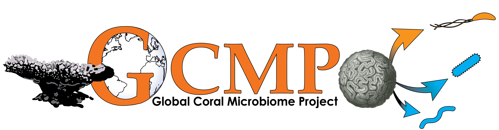

.
# GCMP Global Disease
This project hold the workflow for the Global Coral Microbiome Project's global comparison of coral disease susceptibility and microbiome structure. This project combines microbiome, phylogenetic and trait data to test long-term correlations between coral disease and microbiome structure.

## *Project Organization*:
 
 
### Analysis Folders
The analysis folder will be organized into subdirectories by analytical step. Each analytical step is required to have 3 subfolders: input output and procedure

- analysis/
    - organelle_removal/
        - input/
        - output/
        - procedure/
        
 
**input folder:** Typically, necessary data files cannot be checked in to GitHub. Therefore, scripts at each analytical step should download the files they need as a first step (e.g. with wget or curl). 

**output folder:** The output folder holds all results of the analysis. *All files in output should be able to be regenerated (deleted and then recreated) from the data in input using the scripts in procedure*. This is essential to ensure outputs stay up-to-date if upstream QC steps change (which is common).

**procedure:**. The procedure should be written using Jupyter Notebooks when possible, but R markdown or bash scripts may be more convenient for some steps. If there is more than one procedure file, please create an index file that explains what order to run them in and what each is doing.

#### Workflow

Each step is labelled with **output** that is used in later steps, and **products** that are used in Figures or Supp. Figures in the paper
To recreate the analysis we will run the procedures in the following analysis folders in order:

1. coral_disease_data
      - **input**: raw data from the FRRP, HICORDIS and Lamb et al, disease datasets; the Huang & Roy coral phylogeny
      - **output**: merged_disease_table.tsv
      - **products**: disease prevalence graphs
2. metadata
      - **input**:  GCMP_EMP_map_r28_no_empty_samples.txt
      - **output**: one_hot_encoding_metadata.tsv
3. organelle_removal
      - **input**: 
         GCMP_EMP_map_r28_no_empty_samples.txt -- the sample metadata
         all.seqs.fa -- the sequences from QIITA
         all.biom -- the feature table from QIITA
      - **output**:
         silva_metaxa2_reference_taxonomy.qza -- taxonomic annotations that better detect mitochondrial sequences
         GCMP_seqs.qza
         effects_of_rarefaction/
             feature_table_silva_metaxa_2_all.qza 
         
4. phylogeny_insertion
      - **input**: 
         all.seqs.fa
         (large reference phylogenies are downloaded automatically by the script)
      - **output**:
         insertion-tree_GCMP.qza
         
         insertion-tree_SILVA_GCMP.qza
6. decontamination
      - **input**:
         feature_table_silva_metaxa_2_all.qza
         insertion-tree_SILVA_GCMP.qza 
         silva_metaxa2_reference_taxonomy.qza
         GCMP_EMP_map_r28_no_empty_samples.txt --currently the # in #SampleID is removed manually in this version
      - **output**:
         physeq.noncton-rooted-tree.qza -- the tree of microbes, excluding contaminants
         physeq.noncont-feature-table.qza
7. PICRUSt2
      - **inputs**:
         physeq.noncont-feature-table.qza
         GCMP_seqs.qza
      - **output**:
         EC_metagenome.qza
         KO_metagenome.qza
         pathway_abundance.qza
8. core_analysis
      - **input**:
         GCMP_EMP_map_r28_no_empty_samples.txt
         insertion-tree_silva_GCMP.qza
         Copied via the setup_input_data.py script:
           physeq.noncton-rooted-tree.qza --> physeq_rooted_tree.qza
           physeq.noncont-feature-table.qza --> physeq_feature_table.qza
           physeq.noncont_sample-metadata.txt --> physeq_metadata.txt
           physeq.noncont_tax.txt --> physeq_taxonomy.txt
      - **output**:
           alpha_diversity_phylogenetic/ -- faith's pd .qza and .qzv files 
           beta_diversity_phylogenetic/ -- weighted and unweighted UniFrac bdeta diversity distance matrix .qza files
           adiv_trait_table_all.txt -- a tsv file with alpha diversity and most abundant taxa calculated separately for each species (by Huang Roy tree name)
           adiv_trait_table_mucus.txt -- same but only for mucus
           adiv_trait_table_tissue.txt -- same but only for tissue
           adiv_trait_table_skeleton.txt -- same but only for skeleton
9. coral_disease_vs_adiv 
       - **input**:
       - **output**:
       - **products**:
           phytools contmap plots of adiv (rightwards) vs. disease (leftwards)
           phylomorphospace plots for adiv vs. disease
           PIC results for corelations of adiv vs. disease
           PIC plots for correlations of adiv vs. disease
           heatmap of adiv vs. disease
10. GDM
       - **input**:
           combined_meta.tsv --> merged by the R script from one_hot_encoding_metadata.tsv and GCMP_EMP_map_r28_no_empty_samples.txt
           physeq.noncton-rooted-tree.qza --> physeq_rooted_tree.qza
           physeq.noncont-feature-table.qza --> physeq_feature_table.qza
           physeq.noncont_tax.txt --> physeq_taxonomy.txt
       - **output**:
       - **products**:
       
